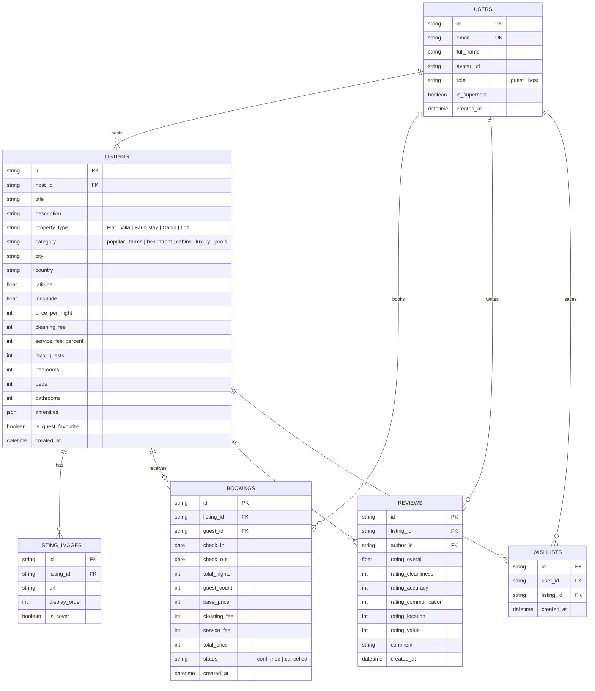

# Airbnb Fullstack Web Application Clone

A production-grade, pixel-accurate clone of Airbnb built for the SDE Fullstack Assignment. Replicates Airbnb's signature design system, search workflows, date-range availability calculations, and host property management.

---

## 🌟 Key Highlights & Implementation Depth

* **Authentic Airbnb Design System**: Replicated using Airbnb's `#FF385C` palette, circular geometry, aspect-ratio 20:19 image carousels, "Guest favourite" badge, and 5-photo bento grid.
* **Expandable 3-Segment Search Capsule**: Exact `Where | When | Who` interactive pill with destination autocomplete, date range selection, and guest steppers.
* **Deterministic Booking & Availability Engine**: Handled with atomic SQL queries to prevent overlapping reservations on confirmed dates.
* **Full Host CRUD Experience**: Real-time property publisher, image manager, active listing deletion/editing, and incoming reservations with payout calculations.
* **Interactive Map View**: Floating "Show map" pill button with custom price tag markers and synchronized stay previews.
* **Evaluator-Friendly Profile Switcher**: Fast-switch between test personas (e.g. *Rohit Sharma (Superhost)* and *Dhruv Patel (Guest)*) directly from the login modal.

---

## 🏗️ Architecture & Technology Stack

```
airbnb-clone/
├── backend/                  # FastAPI + SQLite + SQLAlchemy
│   ├── app/
│   │   ├── database.py       # SQLite connection with foreign keys enabled
│   │   ├── models.py         # SQLAlchemy relational data models
│   │   ├── schemas.py        # Pydantic v2 schemas for type validation
│   │   ├── seed_data.py      # Rich seed data (Noida, Gurgaon, Goa, Jaipur, etc.)
│   │   ├── main.py           # FastAPI entry point & CORS configuration
│   │   └── routers/          # Modular API routers
│   │       ├── auth.py       # Authentication & demo profiles
│   │       ├── listings.py   # Search, filters, category, detail & CRUD
│   │       ├── bookings.py   # Overlap validation, booking & trip retrieval
│   │       ├── host.py       # Host dashboard stats & reservations
│   │       ├── reviews.py    # Multi-dimensional reviews & ratings
│   │       └── wishlists.py  # Wishlist state persistence
│   └── requirements.txt
│
└── frontend/                 # Next.js 14+ (App Router, TypeScript, Tailwind)
    ├── src/
    │   ├── app/
    │   │   ├── page.tsx            # Explore grid (Noida/Gurgaon sections + Map)
    │   │   ├── rooms/[id]/page.tsx # Listing detail (5-photo bento grid + booking widget)
    │   │   ├── trips/page.tsx      # My Trips with reservation cancellation
    │   │   ├── host/page.tsx       # Host Dashboard (CRUD listings & reservations)
    │   │   ├── wishlists/page.tsx  # Saved stays
    │   │   └── layout.tsx
    │   ├── components/             # Reusable Airbnb components
    │   ├── lib/api.ts              # Fully typed API client
    │   └── types/index.ts          # Shared TypeScript interfaces
```

---

## 🗄️ Database Schema Design (SQLite)



### Date Overlap Logic:
A booking request for listing $L$ with range $[\text{check\_in}, \text{check\_out}]$ conflicts with existing confirmed bookings if:
$$\text{existing.check\_in} < \text{new.check\_out} \quad \text{AND} \quad \text{existing.check\_out} > \text{new.check\_in}$$
This constraint is enforced at the database layer before creating any reservation.

---

## 🚀 Quick Start & Setup Instructions

### 1. Backend (FastAPI + SQLite)

```bash
cd backend

# Create and activate virtual environment
python -m venv venv
# On Windows:
.\venv\Scripts\activate
# On macOS/Linux:
# source venv/bin/activate

# Install dependencies
pip install -r requirements.txt

# Start the API server (auto-seeds database on first launch)
uvicorn app.main:app --host 127.0.0.1 --port 8000 --reload
```
* Interactive Swagger API documentation: **`http://127.0.0.1:8000/docs`**

### 2. Frontend (Next.js + TypeScript)

```bash
cd frontend

# Install dependencies
npm install

# Start Next.js dev server
npm run dev
```
* Web application interface: **`http://localhost:3000`**

---

## 🔌 API Overview

| Method | Endpoint | Description |
| :--- | :--- | :--- |
| `GET` | `/api/listings` | Filter stays by category, destination, price, property type, amenities, dates |
| `GET` | `/api/listings/{id}` | Listing details, images, host, reviews, and booked dates |
| `POST` | `/api/listings` | Create a new listing (Host CRUD) |
| `PUT` | `/api/listings/{id}` | Update an existing listing |
| `DELETE` | `/api/listings/{id}` | Delete listing and cascade relations |
| `POST` | `/api/bookings` | Reserve a stay with server-side overlap & price validation |
| `GET` | `/api/bookings/my-trips` | Retrieve authenticated user's confirmed reservations |
| `DELETE` | `/api/bookings/{id}` | Cancel reservation & release blocked dates |
| `GET` | `/api/host/stats` | Retrieve total listings, reservations, and payouts |
| `GET` | `/api/host/listings` | Retrieve properties owned by active host |
| `GET` | `/api/host/reservations`| Retrieve incoming reservations from guests |
| `POST` | `/api/reviews/{listing_id}`| Post a verified review and rating |
| `POST` | `/api/wishlists/toggle` | Toggle favorite state for a listing |
| `GET` | `/api/wishlists` | Retrieve all saved listings for user |
| `GET` | `/api/auth/users` | List demo personas for instant profile switching |
